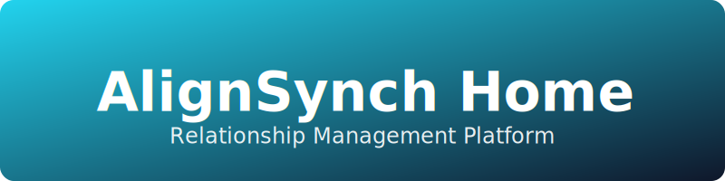
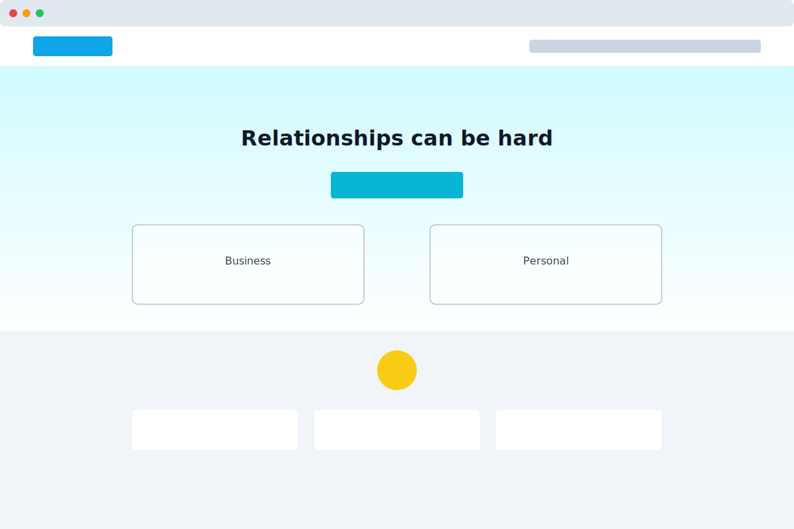

# Home Page Content Registry

## Design Reference

This document serves as a logical content snippet registry for the Home page. It lists all creative copy, in order, by section, mirroring the flow and layout of the actual page.

---

## 1. Global Navigation (Navbar)

**Top Banner:**
> "AlignSynch 2 coming June 2025... Sign up for our launch announcement:"

**Banner Button:**
> "Insider Signup ⚡"

**Logo:**
> "AS AlignSynch"

**Navigation Links:**
- Home
- Relationships
- How it Works
- Pricing
- FAQ
- About Us

**Auth Buttons:**
- "Sign in"
- "Sign up"

---

## 2. Hero Section

**Main Headline:**
> "Relationships can be hard"

**Sub-Headline:**
> "AlignSynch makes it easier"

**Primary Call-to-Action (Button):**
> "Choose a Relationship Type"

**Key Concept Text:**
> "The key concept:
> To know the feelings and handle the expectations of other people,
> enhancing both your professional and private relationships."

**Sub-Concept Text:**
> "Use our AlignSynch tool to uncover gaps in those Understandings and Expectations."

### Carousel Left (Business)
**Title:**
> "Align Your Business Life"

**Items:**
> "Customer, Vendor, Staff, Manager, Teammate, Business Partner, Tenant, Investor, Teacher, Caregiver, etc..."

### Carousel Right (Personal)
**Title:**
> "Synch Your Personal Life"

**Items:**
> "Spouse, Friend, Sibling, Date, Boyfriend, Partner, Girlfriend, Parent, Child, Neighbor, Grandparent, etc..."

---

## 3. Testimonials Section ("The Gizmo")

**Section Header:**
> "See how easy it is to improve any relationship"

**Section Sub-Header:**
> "Think of it as a new type of communication gizmo"

**Description:**
> "This tool helps you identify, express, and/or resolve a difference in opinion on how you feel, wish, think, and guess about various aspects of a relationship"

**Testimonial/Question Cards:**
1. "This let me see where things stand and where we wish them to go in the future."
2. "This works because it opened an easy communication channel for me!"
3. "There would have been no other way for me to see all the angles of this relationship!"
4. "Are you on the 'Same Page' as ______?"
5. "Do not be unpleasantly surprised! You don't know until you ask."
6. "It allowed us to visit some important relationship aspects in a nice soft way to see what we need to work on."
7. "Reach a state of agreement, harmony, and understanding with anyone."
8. "Are you in Alignment with ______?"
9. "Where are your differences with ______?"
10. "Are you In-Synch with ______?"
11. "It was hard for us to discuss these things. This opened our eyes to what we need to work on."
12. "You may not think or know how to ask in a non-confrontational way."
13. "Progress is moving forward, however so slightly, giving hope."
14. "You would be surprised how often the answer is not yes or no, but part way in between is comfortable!"

**Section Footer:**
> "Reduce stress & reduce surprises!"

**Button:**
> "Pick a Relationship Types"

---

## 4. Relationship Types Matrix

### Personal Card
**Title:**
> "Personal"

**Subtitle:**
> "Home Relationship Types"
> "(each has unique aspects)"

**List Items:**
- Spouses
- Girlfriend-Boyfriend
- Committed Significant Others
- Parent-Child
- Siblings
- Friends
- Dating
- Roommates
- Neighbors
- Blank > Create Your Own

### Business Card
**Title:**
> "Business"

**Subtitle:**
> "Professional Relationship Types"
> "(each has unique aspects)"

**List Items:**
- Staff-Manager
- Coworker-Colleague
- Customer-Vendor Product
- Customer-Vendor Service
- Business Partners
- Project Manager-Team Member
- Teammates
- Parent-Teacher
- Teacher-Student
- Investor-SponsorEntrepreneur
- Patient-CareGiver
- Tenant-Landlord
- HOA Board Member-Owner
- Blank > Create Your Own

---

## 5. How It Works Section

**Main Header:**
> "What does it do?"

**Introductory Text:**
> "Provides a way to find out if you are 'On the Same Page' with someone else, then you both adjust aspects of the **Relationship** as needed."

### Step 1
**Title:**
> "1 Express Opinions"

**Body:**
> "It provides people with a way to record their **Opinions** regarding a dozen **Aspects** of a **Relationship**. There are over a dozen pre-populated starting Templates to select from, each formulated with **Aspects** for every type of business or personal **Relationship**. **Aspects** are user-editable for their situation."

### Step 2
**Title:**
> "2 Communicate"

**Body:**
> "As the **Initiator**, you then **Invite** the **Counterparty** to AlignSynch so they may record their **Opinions** regarding the same **Aspects**.
>
> Then both Parties can share their **Opinions**, show the differences, and spark constructive discussions to decrease the **Gaps**, thus improving the **Relationship**."

**Summary Footer:**
> "Simply put: Play with **Relationship** Aspects, Register, Invite **Counterparty**, Give **Opinions**, Share, & Discuss."

---

## 6. Pitfalls & Compromise Section

**Left Column Header:**
> "Most Relationships have two common potential pitfalls >"

**Right Column (Pitfall Scenarios):**
1. "YOU FEEL ______ is Different Than THEY FEEL"
2. "YOU WISH ______ to be Different Than THEY WISH"

**Left Column Header (Part 2):**
> "Relationship answers usually are not just yes or no, the compromise solution is often somewhere in between."

**Right Column (Compromise Scenarios):**
1. "Actually, YOU FEEL ______ is only slightly Different"
2. "It turns out, YOU WISH ______ to slowly Change only a little bit"
3. "Surprise! THEY FEEL ______ is just a tad Different"
4. "Thankfully, THEY WISH ______ to be just a touch more or less"

**Button:**
> "Pick a Relationship Type"

---

## 7. Benefits Section

**Main Header:**
> "Why do I need this?"

**Benefit List Items:**
1. **Reduce Risk of Loss**
   "Relationships are like a dance, one misstep can lead to a disaster. All too often, when you least expect it, the other person gives up on the Relationship. When you are not on the same page, you risk job loss, divorce, customer loss, business failure, or personal partner leaves. Stay in rhythm and keep dancing!"
2. **Improved Relationship Performance**
   "In relationships, we communicate, care for each other, and depend on one another. This helps us evolve and work on other relationships or expectations."
3. **Emotional Well-Being**
   "Good relationships reduce stress and promote mental health. They provide comfort, encouragement, and a sense of community."
4. **Better Physical Health**
   "Good smooth social connections positively impact health. Healthy relationships contribute to overall well-being, boost immune systems, and protect against sickness."
5. **Stress & Anxiety Reduction**
   "Emotional support from business colleagues or loved ones helps manage stress and cope with life's challenges."
6. **Longevity**
   "People with strong social support tend to live longer. Healthy relationships improve lifespan and help us learn and grow."
7. **Sense of Belonging**
   "Healthy relationships create a feeling of community and belongingness, reducing feelings of isolation."
8. **Increased Happiness**
   "Positive relationships contribute to overall happiness and life satisfaction."
9. **Enhanced Self-Esteem**
   "Supportive relationships boost self-worth and confidence."
10. **Better Coping Mechanisms**
    "Having someone to lean on during tough times improves resilience and coping skills."
11. **Improved Communication Skills**
    "Practicing these concepts and interacting with others about a relationship helps refine communication abilities."
12. **Greater Sense of Purpose**
    "Practicing these concepts and interacting with others about a relationship helps refine communication abilities."

**Closing Statement:**
> "Remember, maintaining healthy relationships requires effort, communication, and mutual respect. Whether it's a business colleague, customer, vendor, or a lifelong connection, investing in relationships is worthwhile!"

**Button:**
> "Choose a Relationship Type"

---

## 8. Footer

**Logo:**
> "AS AlignSynch"
> "Improve Important Relationships"

**Copyright:**
> "© 2025 - AlignSynch"

**Social Icons:**
- Instagram
- LinkedIn
- Twitter
